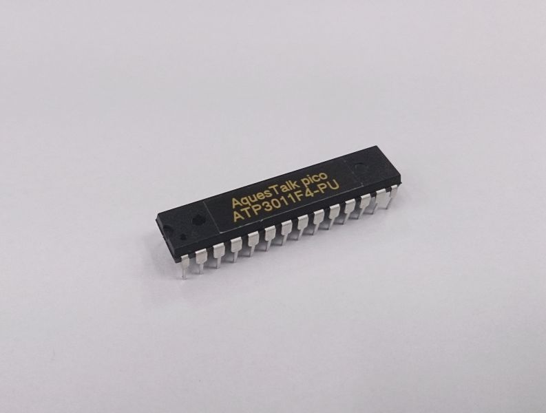
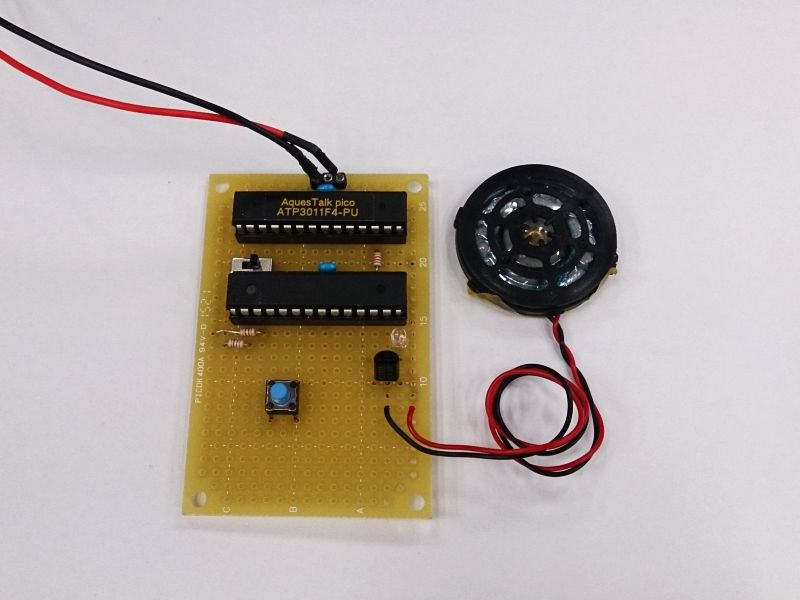

Title: ばばばば ば ばぶばば ばぶばば ぶぶぶ
Subtitle: モールス符号を「バ」と「ブ」で表現する装置
Author: @binzume
Author(romaji): binzume

## とある会社のSlackにて

tboffice『もしもし』

tboffice『モールス信号を「バ」と「ブ」で表現する装置作って欲しい』

僕『？？？』

というわけなのでそれらしいものを作ります．


## AquesTalk pico

　自分でサンプリングして再生するのも考えましたが，めんどい＆自分の声をテストに使うとやる気が終了しそうだったので，秋葉原の秋月電子に行って AquesTalk pico を買ってきました．自転車で往復40分．



　棒読みちゃん等でも使われている AquesTalk のハードウェア版です．
ワンチップの部品で，電源とスピーカーをつなげば，後はシリアルポートにローマ字テキストをを流し込むと喋ってくれます．
初めて使ってみましたが，とても簡単に使えて素晴らしいです．

　説明書のとおりに電源とスピーカーを繋いだあと，まずはPCにUSBシリアル変換基盤でつないでみます．適当なターミナルから「?」を入力すると「>」というプロンプトが返ってくるのを確認．最初，何bpsでデータ遅れば良いんだろうとか思いましたが，最初の「?」で自動設定されるようです．
「konnichiwa.」+ エンター を入力すると「こんにちわ」と喋ってくれます．ここまで約2時間．

```
?>
> konnichiwa.
> <ALPHA VAL="abcd">.
```

　ローマ字読みする以外にも，アルファベットをそのまましゃべるモードとか数字をしゃべるモードがあって地味に便利です．

　とても簡単です．バブみ，あります(無理やり後付け)

## 回路

モールス符号の短点で「ば」，長点で「ぶ」と喋る予定ですが，「ば」と「ぶ」しか使わないのはもったいないので
アルファベットをしゃべってくれる機能を付けたい．こういうとき，Arduinoが楽で良いですが，手元にAVRマイコンのATMEGA88がたくさん余っているので，有効活用します．ちなみに，AquesTalk pico も型番のシールの下はAVRでATMEGA328でした．




　ATMEGA88に入力用のボタンつけて，あとは AquesTalk pico の TX,RX をつないだだけです．

## プログラム

- ボタンの押された時間の長さによって「ば」「ぶ」をしゃべる
- しばらく入力がなかったら，それまでの入力をアルファベットに変換してしゃべる

　なんとなく，そうなる気がしてましたが，『ボタンの押された時間の長さによって「ば」「ぶ」をしゃべる』という最初のところでいきなりはまりました．モールス符号からアルファベットへの変換の方は対応表を全部配列に突っ込んでコードに貼り付けただけで何も頭は使いませんでした．

　ちゃんと計測してないですがAquesTalk pico にデータを送ってしゃべり始めるまでに数十ミリ秒のラグがあります．通常の利用では全く問題ない遅延ですが，ボタンのON/OFFに合わせてリアルタイムで発声させるには，かなり厳しいです．以下のコードは擬似コードです．THRESHOLDは短点と長点の閾値を表す定数です．


### ダメな実装１

```
fun on_button_down() {
  duration = ボタンのON→OFFまでの時間を計測();
  if (duration < THRESHOLD) {
    talk("ba");
  } else {
    talk("bu-");
  }
}
```

ボタンを離すまで発声しないのでダメですね．

### ダメな実装２


```
fun on_button_down() {
  duration =  ボタンのON→OFF もしくは THRESHOLD時間経過した？();
  if (duration < THRESHOLD) {
    talk("ba");
  } else {
    talk("bu-");
  }
}
```

最初に試しに実装したのがこれです．ダメでした．


### マシな実装

```
fun on_button_down() {
    sleep(ちょっと待つ);
    talk("ba");
    duration =  ボタンのON→OFF もしくは THRESHOLD時間経過した？();
    if (duration >= THRESHOLD) {
      talk_stop(); // 最初のbaを中断する
      talk("bu-");
    }
}
```

とりあえず投機的に「ba」の発声コマンドを送り，長点だと分かったタイミングで中断して「bu-」の発声コマンドを送るようにして妥協．

まれに長点が「bbu-」のようにbの子音が重なった感じに聞こえてしまいのは愛嬌ということにしました．


## 最後に

　今回はさすがにやっつけ過ぎた感がありますが，簡単に音声合成できるの良いです．

　モールス用の電鍵(要はスイッチです)を3Dプリンタで作りたかったんですがバブみが足りなかったので断念しました．
(一瞬，購入しようかと思いましたが，やつかっこ良いやつはお高い)

