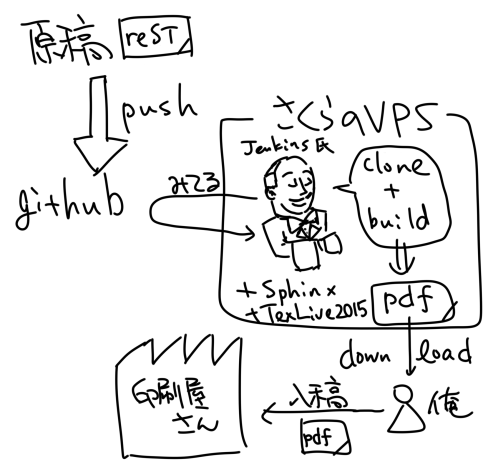
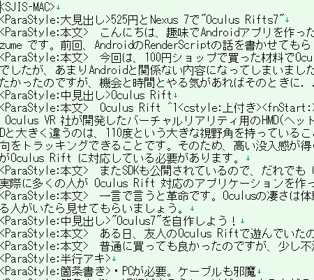
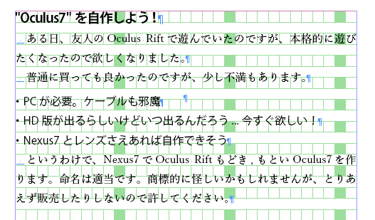

Title: 全自動DTPシステムを作る話
Subtitle: git pushするとJenkinsの口からPDFが出てくる
Author: @tboffice
Author(romaji): tboffice

# 全自動DTPシステム

　「びゃあ゛ぁ゛゛ぁうまひぃ゛ぃぃ゛ぃ゛」（挨拶 [^1]

[^1]: タイトルは全自動卵割り機をリスペクトしています。全自動卵割り機にバブみを感じてしまったあなたは、かなりの変態さんでは？（おまいう）

　どうも@tbofficeと申します。初めましての方ははじめまして、ご無沙汰の人は「またおまえか！」と軽く思っててください。第7開発セクションで、雑用をやっております。

　さて、当サークルでは「ななか Inside PRESS」というプログラミングやらハードウエア系の技術本を作っておりまして、コミックマーケットで頒布しております。その本の本文データ(PDF)を作る話です。

## 初期

　あれは3年前くらいになるんですけど、「ななかInside PRESS」 [^2] が世に出ました。当時は素のLaTeXを使っていて、原稿に `\subsection` などと書いていました。その原稿を github にコミットし、VPS サーバで `git pull` してコマンドを手動で叩いてビルドしていました。その後、糖質制限おじさんとなる前の @j5ik2o さんに Sphinx を使ってみなよ、と言われて [^3] 、 Sphinx でドキュメントをビルドすることになったのでした。Sphinx は reST(reStructuredText) というフォーマットで文章を書いて食わせるとPDFなどの形式に変換してくれるドキュメントビルダーです(一応Markdownも突っ込める)(はず)。

[^2]: 「ななかInside」とか「NANAKA+Inside_PRESS」とか語気揺れが激しいのは内緒だよっ

[^3]: 唆されたともいう（マテ

## ドーモ=ジェンキンス=サン

　それで自動化の波ですよ。ビッグウエーブですよ。乗るしかないんですよこの波アイエエエ(どうすんだよこの流れ)

　えーと、2013年くらいでしたかね、当時筆者が借りていた VPS に Jenkins おじさんも飼うことにして、 github に置いた reST の原稿から自動で PDF にしてくれる仕組みをつくったんですね。



## PDF出力の自動化

こうして、 PDF のビルドを自動化することに成功したのです。バブれますね？

え？これがバブみだと？ぜんぜんバブれない？ふざけるなと！

なるほど、じゃあ上記の図にあるさくらの VPS にあるような Docker イメージを作ればあなたも簡単に環境が手に入って良いですね！ということで作りましたのでお使い下さい。

> https://hub.docker.com/r/tboffice/texlive2015-jenkins/

コマンドにするとこんな感じです。7GBくらいあるのでご注意ください [^7gb] 。起動すると 8080 port で Jenkins が起動しているので、githubプラグインでも手動で入れればいいんじゃないでしょうか [^githubp] 。

[^7GB]: ファイルサイズ小さくしたい。あと手持ちの原稿のビルド用につくったのでソフトウエアのバージョン指定が細かいです
[^githubp]: githubプラグインの自動インストールしようとしたけどまだ出来てないです。汎用的には使えないはず

```
docker pull tboffice/texlive2015-jenkins
```

## docker imageを作るにあたって

　作った　docker image　は TeXLive2015 + Jenkins 1.6　系入りの　Scientific Linux　です。　OS　のチョイスは趣味です。

　TeXLive のインストールはOSのパッケージにあるんですが、いかんせん古いので TeXLive2015 をインストールしました。インストールの方法は主に 2 種類あります。 iso ファイルを `mount` して実行ファイルをインストールする方法と、ネットワークインストール用のパッケージをダウンロードして実行ファイルからインストールする方法です。

　iso のインストールを試したところ、 docker 内で `mount -l loop -p hoge.iso` の実行に失敗。仕方なくネットワークインストールを試みたんですが、パッケージをインターネットから落としてくるのに2時間くらいかかったので断念。

　結局、 doker server 上で iso ファイルを展開してそのディレクトリで HTTP サーバを立ち上げて、 docker image 内から TeXLive2015 [^TeXLive2015] のインストールに必要なパッケージを wget する荒業で回避しました。なにやってんだか。それでも docker build に 30 分くらいかかります。

[^TeXLive2015]: よちよち作ってたらTeXLive2016が5月にリリースされちゃいました

## Sphinx + TeXLiveの利点と欠点

　まずは利点から。 github に push すると数分で PDF が出力されて見た目が確定します。

　欠点としては、 LaTeX に起因する、思ったところに図が置けない問題があります。 LaTeX を使ったことがある人なら一度ならず二度までも、何度も遭遇する現象です。少し調整するたびに push してはビルドして様子見という不毛な作業を繰り返すことになります [^local] 。

[^local]: 個人のローカルにビルドできる環境があるとよいですね

## いまどうしてるの

　長々と Sphinx と TeXLive の話を書きましたが、現在は使っていません。2014年の冬から md2inao [^md2inao_github] + InDesign CC で編集作業を行っています [^konoshimen] 。技術評論社が WEB+DB PRESS を編集するときに使っている方式を真似ています。

　まず原稿を Markdown で書きます。その Markdown を md2inao に入力すると、タグ付きテキストが出力されます。そのタグ付きテキストを InDesign に貼り付けると紙面ができあがります。





　md2inao の github をみてみると、 WEB+DB PRESS で使っているレイアウトの PDF があるので、それを真似すれば WEB+DB PRESS そっくりな紙面ができあがります。画像の位置も好きなところに配置できます。

　デメリットとしては、InDesignでレイアウトを作るのが大変でした（こなみ）。また、 Sphinx+TeXLive 方式ではビルドツールを利用すれば入稿用の PDF が出来上がります。 InDesign の場合は、手動でタグ付きテキストを張り込まなければなりません。画像の周りに文章を回りこませることができますが、画像を拡縮・移動させると文章も移動してしまうので、慣れるまでに時間がかかります。

　InDesignを使うと、見た目が美しいので、ハマると抜け出せなくなります。 タグ付きテキストを張り込む作業を自動化するには、InDesign CC Server というのがあれば出来そう、というところまでは分かったのですが、企業向けのソフトウエアなのでかなり高そうなオーラを発しているので、違う意味でバブみがあります。

[^konoshimen]: この紙面もmd2inao+InDesignで作っています
[^md2inao_github]: https://github.com/naoya/md2inao

## 補足

　md2inaoはオンライン版もあります。また、Sphinxのドキュメント(reST)からタグ付きテキストを生成するSphinx Indesign Builderというのもあります [^sphinxindedignbuilder] 。

[^sphinxindedignbuilder]: http://tdoc.info/blog/2015/08/21/webdbpress.html

## まとめ

　バブみを感じるために頑張ってきましたが、まだバブれそうにありません。バブみへの道のりはまだまだ遠いようです。
